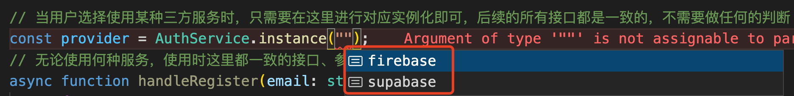

[toc]

# 把 ”中台“ 的思想迁移到代码中去

摘要：不同的服务提供方对应着不同的接口，要怎样避免直接在代码中杂糅判断逻辑呢？要怎么才能在使用时不用去在乎某个服务提供的是什么接口，需要什么参数，响应什么样的结构体和返回什么样的异常错误呢？本文就来剂良药，把 ”中台“ 的思想引入到代码中来，一针见血的解决这个问题。

## 1 怎样~

首先一起来看一个实际的例子，到底在项目中遇到了什么问题。

开发登陆注册功能时，有两个可供用户随意选择三方服务 ——  Firebase 和 Supabase 方式（可理解为微信 和 QQ 登陆），它们分别提供以下能力：

- 邮箱注册
  - Firebase ——  createUserWithEmailAndPassword
  - Supabase —— signUp
- 邮箱验证
  - Firebase ——  sendEmailVerification
  - Supabase —— emailForVerification
- 邮箱登陆
  - Firebase ——  signInWithEmailAndPassword
  - Supabase —— signIn
- 密码重置
  - Firebase ——  sendPasswordResetEmail
  - Supabase —— resetPasswordForEmail
- 用户登出
  - Firebase ——  signOut
  - Supabase —— signOut

可以看到，不同的服务对应的接口是完全不同的，除此之外，不同的服务提供的接口还存在以下差异：

- **所需要的参数格式不尽相同**
- **所返回的响应体格式不尽相同**
- **异常错误的捕获格式不尽相同**

在项目中使用时，由于没有做逻辑的统一，代码中出现了**大量的判断逻辑**，用以实现用户在选择使用不同的服务时底层正确的使用对应的接口，诸如以下代码：

```js
// 用户注册逻辑
if(用户选择的服务 == Firebase) {
  formatFirebaseParams() // 格式化注册参数，不同的服务所需参数格式不同
  try {
    response = createUserWithEmailAndPassword(...)	// Firebase 注册逻辑
    user = formatFirebaseResponse(response) // 格式化返回体，不同的服务返回体格式不同         
  } catch (e) { // 处理异常，不同的服务捕获的异常错误格式不同
    if(e.code === '邮箱已存在') {
      throw '邮箱已存在' 
    } else if(){} ....
    ...
  }
  
} else {
  formatSupabaseParams() // 格式化注册参数
  try {
    response = registerByEmail(...)	// Supabase 注册逻辑
    user = formatSupabaseResponse(response) // 格式化返回体          
  } catch (e) { // 处理异常
    if(e.code === 1001) {
      throw '邮箱已存在' 
    } else if(){} ....
    ...
  }     
}
```

从上可以看到，在没有统一处理的情况下，这些**逻辑直接杂糅在业务中显得十分的混乱**，并且，可以预见的是，**随着提供登陆的三方服务的增加，这里的逻辑将相应的增加**，这将给开发带来了巨大的成本：

- 只要新增一种服务类型，每一个使用服务的地方都需要增加相应逻辑
- 只要新增一处使用，需要把所有服务对应的逻辑都添加上

## 2. 思考？

有没有一种办法可以解决这个问题呢？能够实现以下特性：

1. 统一使用时的接口

   - 不论用户选择的是 Firebase 还是 Supabase，<font color='red'>业务代码中调用的是统一的接口</font>，如 createUser(email, password)，不再区分服务。
   - 同时，业务代码调用时不用再对参数进行分服务格式化

2. 统一返回体格式

   - 不论用户选择的是 Firebase 还是 Supabase，<font color='red'>业务代码中使用时返回的响应体结构一致</font>

3. 统一异常捕获格式

   - 不论用户选择的是 Firebase 还是 Supabase，针对同一种类型的错误，<font color='red'>在捕获时返回的错误一致</font>

## 3. 走起！

要如何才能使得不同服务都提供同一套接口呢？也不难想，就是 <font color='red'>**中台**</font> 的思想，实现一个中台方：

- 对外：提供统一的接口服务给业务方，当然业务方可以随意选择期望使用的底层服务
- 对内：把不同的底层服务收拢起来，把它们的接口进行封装成一致的接口，包括：
  - 参数的格式化
  - 接口的封装
  - 异常错误的捕获统一化

1. 统一接口

   利用抽象类统一对外暴露的接口

   ```ts
   export default abstract class AuthBase {
     abstract initialize(): void;
     abstract get currentUser(): User;
     abstract createUser(email: string, password: string): Promise<User>;
     abstract emailVerification(): Promise<void>;
     abstract loginIn(email: string, password: string): Promise<User>;
     abstract logOut(): Promise<void>;
     abstract passwordReset(email: string): Promise<void>;
   }
   ```

2. 基于抽象类封装三方服务 

   ```ts
   import { createUserWithEmailAndPassword } from "firebase/auth";
   import {
     WeakPasswordAuthException,
     EmailAlreadyInUseAuthException,
     InvalidEmailAuthException,
     GenericAuthException,
   } from "../auth_exceptions";
   // firebase 实现基类
   export default class FirebaseAuthProvider implements AuthBase {
     auth: Auth;
   
     initialize(): void {
      ...
     }
   
     get currentUser(): User {
      ...
     }
   	// 实现基类中的统一方法
     async createUser(email: string, password: string): Promise<User> {
       // 如果需要对参数进行格式化，在此处进行
       try {
       // 调用 firebase 对应的服务 
         const { user } = await createUserWithEmailAndPassword(
           this.auth,	// firebae 所需的参数
           email,
           password
         );
       // 返回统一的响应体结构
         return {
           id: user.uid,
           email: user.email!,
           isEmailVerified: user.emailVerified,
         };
       } catch (e) {
         switch (e.code) {
             // 捕获错误，并抛出统一的错误响应
           case "email-already-in-use":
             throw new EmailAlreadyInUseAuthException();
           case "weak-password":
             throw new WeakPasswordAuthException();
           case "invalid-email":
             throw new InvalidEmailAuthException();
           default:
             throw new GenericAuthException();
         }
       }
     }
   
     async emailVerification(): Promise<void> {
       ...
     }
   
     async loginIn(email: string, password: string): Promise<User> {
     	...
     }
   
     async logOut(): Promise<void> {
       ...
     }
   
     async passwordReset(email: string): Promise<void> {
       ...
     }
   }
   
   ```

   ```ts
   import { User } from "../types";
   import AuthBase from "../auth_base";
   import { createClient, SupabaseClient, AuthUser } from "@supabase/supabase-js";
   import {
     WeakPasswordAuthException,
     EmailAlreadyInUseAuthException,
     InvalidEmailAuthException,
     GenericAuthException,
   } from "../auth_exceptions";
   // supabase 实现基类
   export default class SupabaseAuthProvider implements AuthBase {
     supabase: SupabaseClient;
   
     initialize(): void {
       ...
     }
   
     get currentUser(): User {
      	...
     }
   	// 实现基类中的统一方法
     async createUser(email: string, password: string): Promise<User> {
       try {
         const { user, error } = await this.supabase.auth.signIn({
           email,	// supa 所需参数
           password,
         });
         if (user !== null) {
           // 返回统一的响应体结构
           return {
             id: user?.id,
             email: user.email!,
             isEmailVerified: !!user.new_email,
           };
         } else {
           const status = error?.status;
           switch (status) {
               // 捕获错误，并抛出统一的错误响应
             case 1001:
               throw new EmailAlreadyInUseAuthException();
             case 1002:
               throw new WeakPasswordAuthException();
             case 1003:
               throw new InvalidEmailAuthException();
             default:
               throw new GenericAuthException();
           }
         }
       } catch (e) {
         throw new GenericAuthException();
       }
     }
   
     async emailVerification(): Promise<void> {
       ...
     }
   
     async loginIn(email: string, password: string): Promise<User> {
       ...
     }
   
     async logOut(): Promise<void> {
       ...
     }
   
     async passwordReset(email: string): Promise<void> {
       ...
     }
   }
   
   ```

   在这里，基于基类，我们便实现了

   - **封装各服务对应的接口并且提供统一的对外接口**

   - **统一返回体格式**
   - **统一错误捕获**

3. 多服务的聚合

   ```ts
   import { User } from "./types";
   import AuthBase from "./auth_base";
   import FirebaseAuthProvider from "./provider/firebase_auth_provider";
   import SupabaseAuthProvider from "./provider/supabase_auth_provider";
   
   const providerMap = {
     firebase: new FirebaseAuthProvider(),	
     supabase: new SupabaseAuthProvider(),
   } as const;
   
   export type ProviderEnum = keyof typeof providerMap;
   
   // 将所有服务做聚合，业务在使用时不需要感知服务底层，直接使用统一的接口即可
   export default class AuthService implements AuthBase {
     constructor(private provider: AuthBase) {}
   
     static instance(provider: ProviderEnum) {
       return new AuthService(providerMap[provider]);
     }
   
     initialize(): void {
       this.provider.initialize();
     }
   
     get currentUser(): User {
       return this.provider.currentUser;
     }
   
     createUser(email: string, password: string): Promise<User> {
       return this.provider.createUser(email, password);
     }
   
     emailVerification(): Promise<void> {
       return this.provider.emailVerification();
     }
   
     loginIn(email: string, password: string): Promise<User> {
       return this.provider.loginIn(email, password);
     }
   
     logOut(): Promise<void> {
       return this.provider.logOut();
     }
   
     passwordReset(email: string): Promise<void> {
       return this.provider.passwordReset(email);
     }
   }
   ```

3. 使用

   ```ts
   import AuthService from "./auth/auth_service";
   import {
     WeakPasswordAuthException,
     EmailAlreadyInUseAuthException,
     InvalidEmailAuthException,
   } from "./auth/auth_exceptions";
   
   // 当用户选择使用某种三方服务时，只需要在这里进行对应实例化即可，后续的所有接口都是一致的，不需要做任何的判断
   const provider = AuthService.instance("firebase");
   // 无论使用何种服务，使用时这里都一致的接口、参数、响应体和错误响应
   async function handleRegister(email: string, password: string) {
     try {
       const user = await provider.createUser(email, password);
       // user 格式统一
     } catch (e) {
       if (e instanceof EmailAlreadyInUseAuthException) {
         // 抛出对应的错误信息
       } else if (e instanceof WeakPasswordAuthException) {
         // 抛出对应的错误信息
       } else if (e instanceof InvalidEmailAuthException) {
         // 抛出对应的错误信息
       } else {
         // 抛出对应的错误信息
       }
     }
   }
   ```

   当用户在选择某种服务时，在业务代码中不需要关心用户的选择，不需要做任何逻辑上的判断，只需要在初始化实例时选择对应的服务即可，后续所有的逻辑均不需要在业务中对不同服务进行判断和处理，因为已经是：

   - 统一的接口
   - 统一的返回体
   - 统一的异常错误
   
   <div align='center'> </div>

## 4. 想想…

其实这样的思想并不难，但是挺难在项目中看到的，并不是开发的同学不会写，更多的应该是没有朝着这个方面去思考，从观念上没有去跟进。

在此记录这样的思想，之后只要遇到相同的场景，尽量地往这个方向去靠。我相信，这样的代码不论是可读性还是可维护性，都会高很多。

[点击可查看文章中的完整代码](https://github.com/ardor-zhang/unified-external-interface)。
